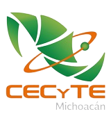

<h1 align="center">
 &#128075 Hi, there!
</h1>

```ts
export class Info {

  name: string = 'jose correa m.'
  age: number = 22
  nationality: string[] = ['Mexican']
  languages: Record<string, string>[] = [{ 'Spanish': 'Native' }, { 'English': 'B1' }]
  school: string = 'Instituto Tecnológico Superior De Ciudad Hidalgo'
  occupation: string = 'Student'
  freetime: string[] = ['Gym', 'Reading', 'Hanging out with friends']

}

export class Programming {

  languages: string[] = ['Java', 'JavaScript', 'PHP', 'Python']
  stylesheets: string[] = ['CSS', 'SASS', 'SCSS']
  frameworks: string[] = ['Bootstrap']
  runtimes: string[] = ['Node']
  databases: string[] = ['MySQL', 'MariaDB']
  learning: string[] = ['tailwind', 'Angular', 'Mongo']
  projects: string[] = ['IoT rfidproject', 'Angular inventory app', 'Headphones landing page', 'Courses landing page']

}

export class Social {

  website: string = 'coming soon'
  github: string = 'josecorreamorales'
  discord: string = 'josecorream.'
  linkedin: string = 'linkedin.com/in/jose-correa-morales/'

}
```


## Toolkit:

### Programming Languages I'm familiar with

<p align="center">
  
  
  
  

</p>

<p align="center">
  
</p>


### Frontend and design stack

<p align="center">
  
  
  
  
  
   


</p>

### Backend Stack
<p align="center">
  
  
   
  
</p>

### Workspace and tools I'm familiar with
<p align="center">


</p>


<p align="center">
  
<details>
  <summary>📃 &nbsp;Resume</summary>


## Education



- 📖 **&nbsp;Technical Programming Program**\
📆 &nbsp;2016 - 2019\
📍 **&nbsp;[CECyTEM 17](http://cdhidalgo.cecytem.net/)** - Ciudad Hidalgo, Michoacán, México


- 📖 **&nbsp;Computer Systems Engineering**\
📆 2019 - Present\
📍 **[Instituto Tecnológico Superior De Ciudad Hidalgo](https://cdhidalgo.tecnm.mx/)** - Ciudad Hidalgo, Michoacán, México


- 📖 **&nbsp;Udemy Bootcamp**\
📆 &nbsp;Present\
📍 **&nbsp;[The Complete 2023 Web Development Bootcamp](https://www.udemy.com/course/the-complete-web-development-bootcamp/) by Dr. Angela Yu** - Udemy 

## Volunteering


- 👨‍💻 **&nbsp;Volunteer in the design department**\
📆 &nbsp;2022 - Present\
📍 **Instituto Tecnológico Superior De Ciudad Hidalgo** - Ciudad Hidalgo, Michoacán, México


- 👨‍💻 **&nbsp;Community service at [ITSCH](https://cdhidalgo.tecnm.mx/) as webDev for Klasster Group entrepreneurship**\
📆 &nbsp;2022 - Present\
📍 **Instituto Tecnológico Superior De Ciudad Hidalgo** - Ciudad Hidalgo, Michoacán, México


## Projects

<p align="right">

</p>

[](https://github.com/josecorreamorales/PapeleriaJIM)

[](https://github.com/josecorreamorales/rfidproject)

[](https://github.com/josecorreamorales/headphones-landing-page)

[](https://github.com/josecorreamorales/Landing-page-courses)

[](https://github.com/josecorreamorales/SmartHomeApp)

 
</details>
